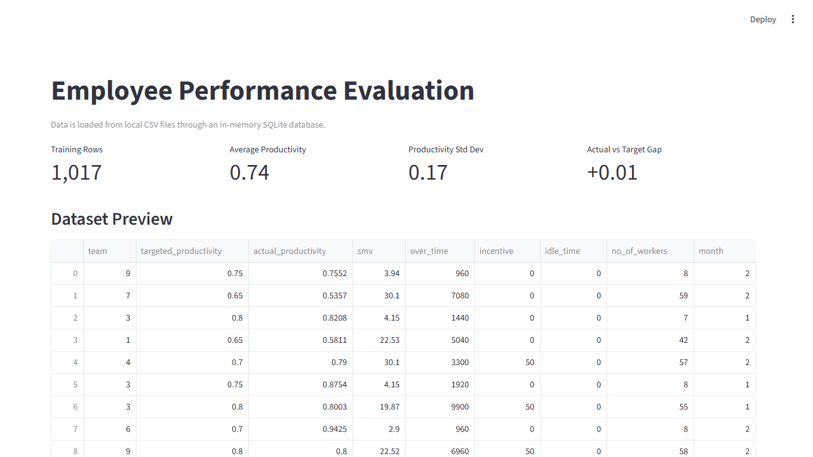
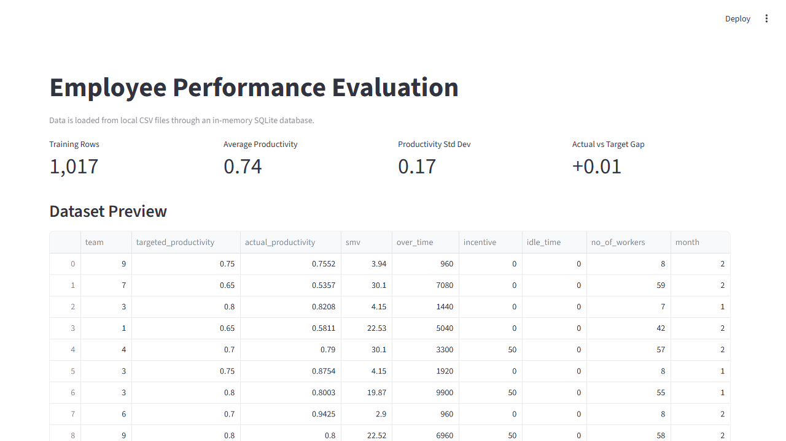

# Employee Performance Evaluation

This project is a Streamlit dashboard for evaluating garment employee productivity. It loads the local CSV datasets, stores them in an in-memory SQLite database, queries the data back into pandas, visualizes team and productivity patterns, and trains a basic linear regression model to predict actual productivity.

## Features

- Loads `train_dataset.csv` and `test_dataset.csv` with repo-relative paths.
- Uses SQLite tables named `train_employees` and `test_employees` for basic SQL-based loading.
- Uses NumPy for productivity statistics and prediction input preparation.
- Shows team productivity, a correlation heatmap, monthly productivity trends, and overtime/productivity scatter analysis.
- Trains a linear regression model using `over_time`, `incentive`, `idle_time`, `no_of_workers`, and `smv`.

## Project Structure

```text
.
├── app.py
├── train_dataset.csv
├── test_dataset.csv
├── employeeesinfo evolution''.ipynb
├── docs/
│   └── screenshots/
│       ├── dashboard-overview.png
│       └── dashboard-full.png
└── README.md
```

## How to Run

Install the required Python packages:

```bash
pip install streamlit pandas numpy scikit-learn matplotlib
```

Start the Streamlit app:

```bash
streamlit run app.py
```

Then open the local URL shown in the terminal, usually:

```text
http://localhost:8501
```

## Screenshots

### Dashboard Overview



### Full Dashboard



## Resume Description

Employee Performance Evaluation Dashboard: processes employee productivity data with Python, SQLite, pandas, NumPy, Streamlit, and scikit-learn to visualize performance trends and predict actual productivity.
